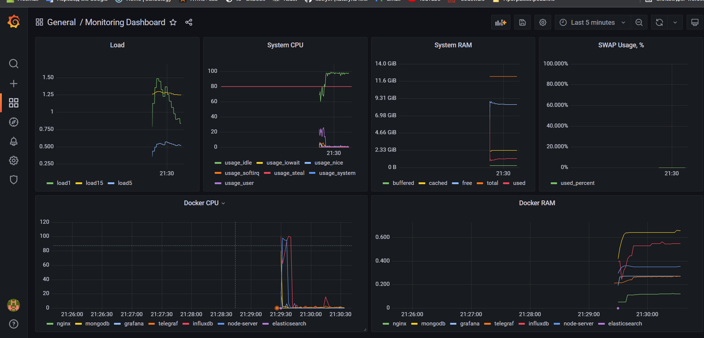

# highload-sw-arch-hw-02

# Prerequisites
* docker
* linux + bash

# 1. Download ab + spin up all required services + setup dashboard + run ab
```
./run.sh
```

# 2. Observe results in grafana + generated test.log


# 3. Clean up
```
./cleanup.sh
```

